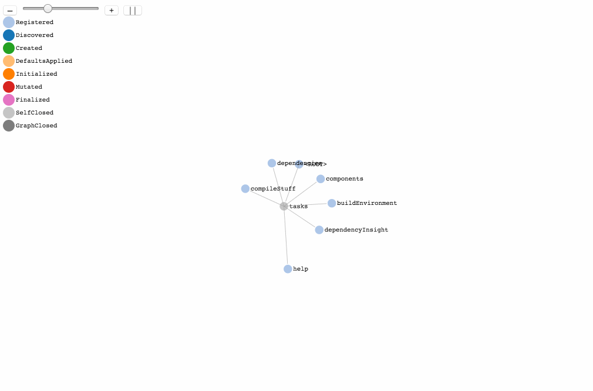

## Gradle Software Model Log Visualizer

Try it:

* http://gradle.github.io/gradle-model-vis/


### Here's how to use

1. Run Gradle with some task and convert the debug output to a JSON

    ```text
    $ ./gradlew --debug model | groovy process-log.groovy > samples/gradle-model.json
    ```

2. Start web-server

    ```text
    $ python -m SimpleHTTPServer 8080
    ```

3. Open [http://localhost:8080/#samples/gradle-model.json](http://localhost:8080/#samples/gradle-model.json)


